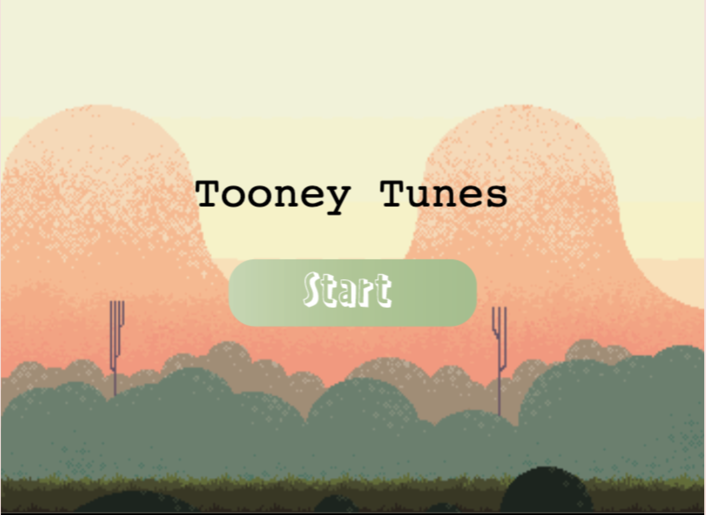
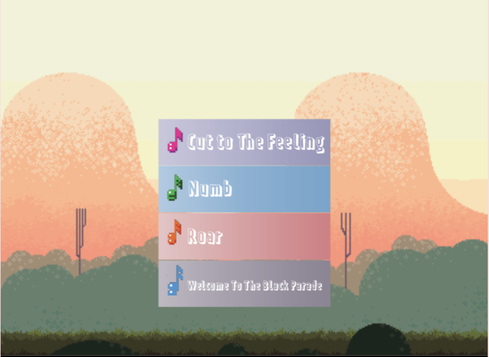
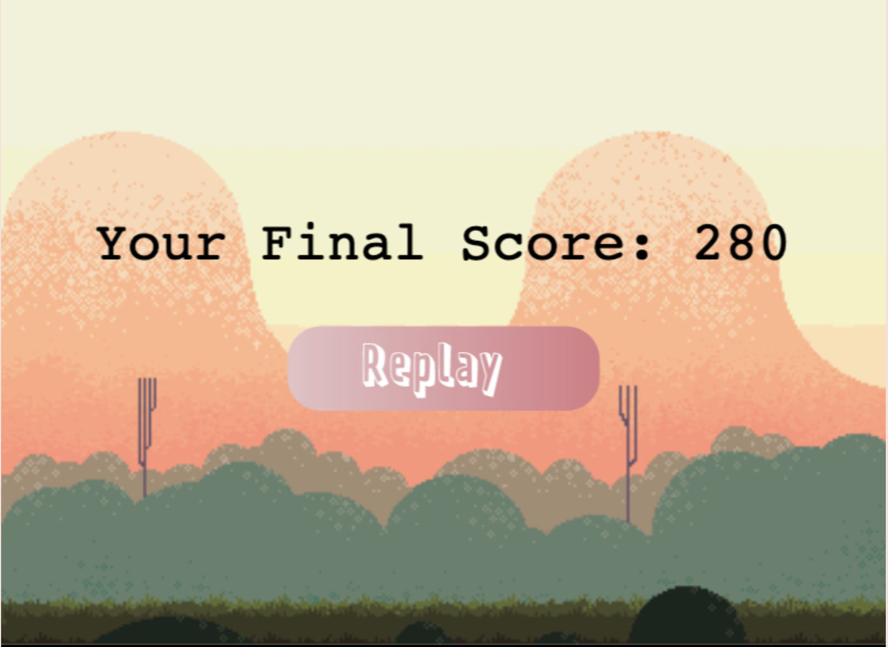

# Tooney Tunes

## Description
A web-based Phaser game that lets you play a platformer game from your Spotify playlist, and enjoy navigating through platforms, obstacles, collect tunes along the playback of your favorite songs!

## Project link:
https://devpost.com/software/tooney_tunes

## Video Link:
https://youtu.be/bv7nZMmdtUM

## Tech Used:

- Phaser for gameplay
- Spotify API to fetch and analyse tracks to get track information
- melody.ml to split the song into componnents
- Node for backend to handle all API calls

## Landing Page

The user starts off by signing in from the landing page using their Spotify account. The Spotify API is used to analyze the tempo and beats of the songs for gameplay. 

## The Game

### Menus

#### Start Menu

After the user signs in using Spotify, the game begins at the start menu. This page is located in `public/js/startScene.js`. After pressing the start button, they are redirected to the song choice menu.

#### Song Choice Menu

In the song choice menu, the user can choose one of three songs to play. After choosing a song, the user is redirected to the game. This page is located in `public/js/pickScene.js`.

#### Restart Menu

After finishing the game, the user can view their score, and choose to play another game. This page is located in `public/js/restartScene.js`.

### Gameplay

#### Points

The user presses the space bar to jump and navigate between platforms. Each time they collect a music note, their score increases by 10.

#### Bombs

Each time the user comes into contact with a bomb, their health decreases by 1, and the music reduces to a single track. The user only has four lives.

#### Powerups

Every 300 points, the user gains a shield that prevents them from losing a life from the next bomb they hit. Every 550 points, they get another life back.

## Future Expansions

- Using the Spotify API to generate a map for the user's most played song
- More powerups for the user
- Different types of obstacles

## Contributors

- [Dipanwita Guhathakurta](https://github.com/susiejojo)
- [Mondale Felix](https://github.com/MondaleFelix)
- [Emily Amspoker](https://github.com/eamspoker)

